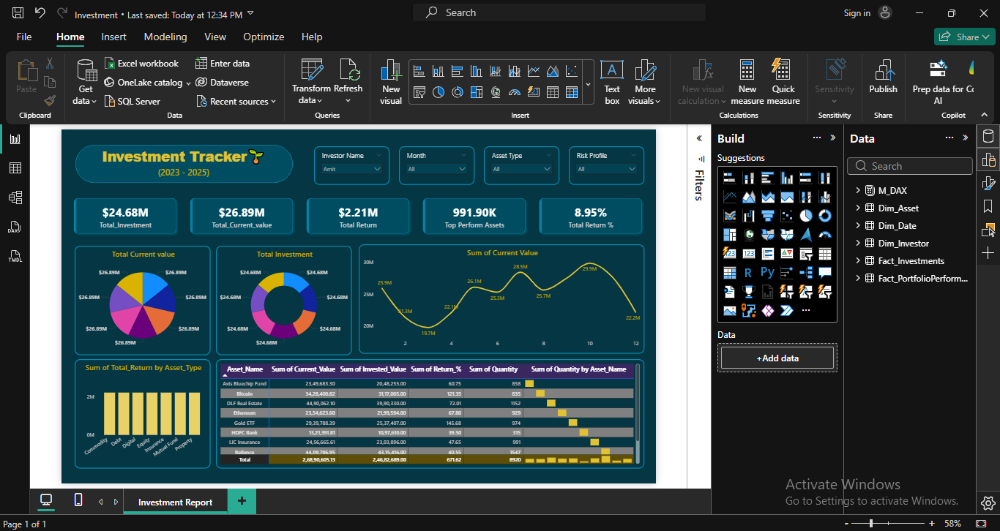

# My Investment Portfolio Tracker

Hey there! 👋

This is the little Power BI dashboard I built to keep track of my own investments. Nothing fancy or enterprise-level — just a clean, personal way to see how my money is doing: total returns, asset split, individual stock/fund performance, and whether I'm actually making (or losing) money over time.

I update the Excel file every now and then when I buy/sell something or when prices change, refresh Power BI, and instantly get the updated picture. Thought I'd share it in case it's useful for someone else who's manually tracking their portfolio too.

### What it shows

- Quick overview: how much I've put in, what it's worth now, total profit/loss
- Pie chart of where my money lives (stocks, mutual funds, bonds, cash, etc.)
- Growth over time — nice line/area charts so I can see the trend
- Per-holding details: buy price, quantity, current value, unrealized gain/loss
- Some key numbers like XIRR, CAGR, best & worst performers
- Month-over-month / year-over-year changes (when I feel like comparing)

(Here's a closer look at the holdings table/page)

### What's inside the repo

- `Investment.pbix`          → the actual Power BI report file  
- `Investment_Portfolio_Tracker_Dataset.xlsx` → my transaction/holding data (this is what you would edit)  
- `Investment Report.png`    → main dashboard screenshot  
- `Amit_Investment.png`      → detailed holdings screenshot  

### How I use it (and how you can too)

1. Grab **Power BI Desktop** (it's free) → https://powerbi.microsoft.com/desktop/

2. Open the Excel file `Investment_Portfolio_Tracker_Dataset.xlsx`  
   → Add your own buys, sells, dividends, etc.  
   → Try to keep the same column names/structure if possible (Date, Symbol, Type, Quantity, Price, etc.)  
   → Save it

3. Open `Investment.pbix` in Power BI Desktop  
   → Hit **Refresh** (Home tab) if it doesn't update automatically  
   → Play around with the slicers (dates, categories, assets) — it's all interactive

4. Optional: Publish to Power BI service if you want phone access or auto-refresh (needs a free Microsoft account)

That's basically it. No complicated setup, no APIs, no subscriptions — just Excel + Power BI.

### A few behind-the-scenes notes

I used regular DAX for most calculations (XIRR was a lifesaver for irregular cash flows).  
The model is pretty simple: transactions → holdings → measures → visuals.  
Feel free to rip apart the DAX, add new pages, or change colors — it's all yours to mess with.

Made with ☕ by **Ajit Kumar Dass**

Happy tracking, and hope your portfolio keeps going up and to the right! 📈
